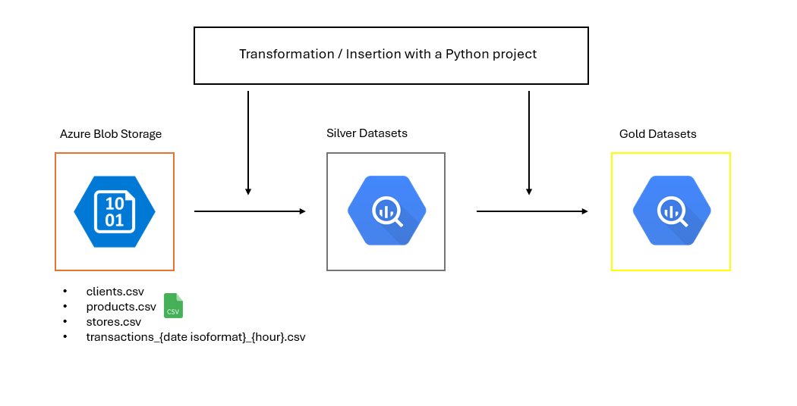
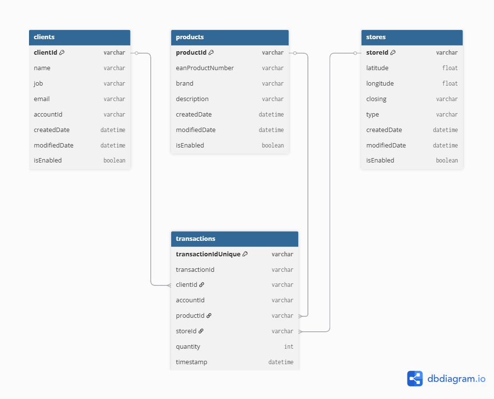

# Data Engineer Test : Ingest Data from a private Azure Storage Blob to mutltiples/different tables in Google Big Query

## Description

In this project, we ingest data from an Azure Storage Blob. The datasets include information on customers, products, stores, and transactions.

Customer, product, and store data are all dimension-type data, and are processed in a similar way. In the current version of the code, these dimension tables are processed every time the pipeline runs, but in practice, the code will be executed only once. The corresponding modules will only run again if their original CSV files are modified.

As for transaction data, which is treated as fact data, new entries are added daily. To handle this, we designed the ingestion logic to load all transaction files during the initial run. After that, it will only ingest new data—specifically, files whose date (included in the filename) is more recent than the latest date already inserted in the transactions table within Google BigQuery.

We use specific access keys for both Azure Storage Blob and Google BigQuery. These keys are stored in dedicated folders and are only read when needed.

We follow a medallion architecture to process the data. Since the data stored in Azure Storage Blob is stable and directly accessible, we consider this the Bronze layer. From there, we ingest and transform the data into a Silver dataset. Finally, we retrieve the Silver data again and further refine it to meet the standards required for the Gold layer.

#### Project Architecture for Loading Data from Azure Blob Storage into a DBMS (Google BigQuery)



#### Data model at the Gold layer




## Prérequis 

A tool to run Python code and use Poetry.


## Usage Guide


This guide explains how to run the project using [Poetry](https://python-poetry.org/), which handles dependency management and virtual environments.

#### 1. Navigate to the InTheMemory folder

Open a terminal and change your current directory to the InTheMemory folder.


#### 2. Install Dependencies with Poetry

Before running the code, make sure all required modules are installed. From the root of the project, run:

```bash
poetry install
```

This will automatically create a virtual environment and install all dependencies listed in the `pyproject.toml` file.

---

### 3. Launch the Project

Once dependencies are installed, you can launch the main script:

```bash
poetry run runapp
```

If you encounter any errors and have created a virtual environment in the previous steps, try this code  and then repeat steps 1 and 2.

```bash
echo $env:VIRTUAL_ENV
Remove-Item Env:\VIRTUAL_ENV
```

## Optional 

In the transactions_silver code, there is a commented section. To test the incremental loading of transactions, you need to uncomment this part, run the main script, and then comment it again. This allows you to simulate the process.
Another way to test it is by adding a recent file to Azure Blob Storage.

```bash
if "2023-11-30" in blob.name:
    print(f"File ignored (manually filtered): {blob.name}")
    continue
```


## Author

Romain Ruiz 
